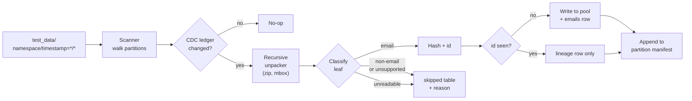

# Email Ingestion Pipeline

A Python pipeline that discovers email files in date-partitioned customer
buckets, recursively unpacks containers (ZIP, MBOX), deduplicates by content
hash, preserves full lineage, and stages clean individual emails to a
content-addressed pool. State is backed by SQLite for CDC and crash-safety.

---

## 1. Setup & Run

The pipeline only depends on the Python standard library; `pytest` is the
sole dev dependency.

```bash
python -m venv .venv
source .venv/bin/activate
pip install -e ".[dev]"
```

### Run

```bash
# Backfill (process everything currently in the bucket)
python -m email_ingest run --mode backfill --bucket test_data --state state/

# Incremental (only new/changed files since last run)
python -m email_ingest run --mode incremental --bucket test_data --state state/
```

Sample output (the first backfill against `test_data/`):

```
mode=backfill scanned=5 new=5 changed=0 unchanged=0 metadata_only=0 failed=0 emails_staged=8 relinked=0 skipped=0
```

A second invocation is cheap — CDC short-circuits unchanged files:

```
mode=incremental scanned=5 new=0 changed=0 unchanged=5 metadata_only=0 failed=0 emails_staged=0 relinked=0 skipped=0
```

After a run, the state directory contains:

```
state/
  state.db                         # SQLite: source_files, emails, lineage, skipped
  staging/
    emails/                        # content-addressed pool, sharded by 2-hex prefix
      ab/ab12...ef.eml
      ...
    manifests/
      <namespace>/
        timestamp=YYYY-MM-DD/
          manifest.jsonl           # one record per (email, source) discovered
  tmp/                             # transient; wiped on startup
```

### Test

```bash
pytest
```

124 tests across happy-path, identity, CDC, scanner, every unpacker handler,
staging, crash-recovery, and the comprehensive edge-case suite.

---

## 2. Architecture



The pipeline is split into focused, independently testable modules. Each
phase ends with green tests so we can stop cleanly at any point.

| Module | Responsibility |
|---|---|
| `scanner.py` | Walk `<namespace>/timestamp=YYYY-MM-DD/*` into `ScannedFile(namespace, partition, relpath, size, mtime_ns)` records. Pure `stat()` — no reads. |
| `cdc.py` | Two-step change detection against the `source_files` ledger. Emits `NEW` / `UNCHANGED` / `METADATA_ONLY` / `CHANGED` verdicts. |
| `unpacker/` | Registry-based recursive container unpacking via a BFS worklist. Handlers for ZIP, MBOX, EML, HTML, and the recognized-but-deferred MSG/PST. |
| `identity.py` | Tenant-scoped content identity. `email_id`, `source_id`, canonicalization, pool-path sharding. |
| `staging.py` | Atomic `tmp → fsync → rename → dir-fsync` write into the content-addressed pool. Per-partition `manifest.jsonl` append with fsync. |
| `state.py` | SQLite open/migrate, FK enforcement, the `transaction()` context manager. |
| `pipeline.py` | The orchestrator: `scan → CDC → unpack → stage → DB+manifest commit`, plus `recover_startup()` run before every invocation. |
| `cli.py` | `python -m email_ingest run …` argparse entrypoint. |

---

## 3. Identity design

### `email_id` — the dedup key

```
email_id = sha256(namespace || 0x00 || canonical_bytes)
```

The id is **tenant-scoped**, so two different customers uploading the same
email each get their own staged copy. Within a single tenant, two byte-for-
byte-identical emails (whether they came from an EML, an MBOX member, or a
deeply nested ZIP) collapse to a single `emails` row plus multiple `lineage`
rows.

The `0x00` separator between namespace and content prevents trivial
concatenation collisions: without it, `("ab", "cd…")` and `("abcd", "…")`
would share the same hash input.

#### Canonicalization

A tiny canonicalization pass collapses framing differences that have no
semantic meaning:

1. Strip UTF-8 BOM.
2. Strip a leading MBOX `From ` separator (in case it leaked through).
3. Normalize line endings (`\r\n` and lone `\r` → `\n`).
4. Strip trailing whitespace.

This is deliberately conservative — it only neutralizes container/encoding
artifacts. **Headers and body are left untouched** for the downstream
normalization stage to own.

The practical payoff: a `simple_email.eml` that lives at the bucket root,
the same email re-uploaded inside a `batch.zip`, and the same email
appearing as an MBOX member all dedupe to one staged copy.

### `source_id` — the location key

```
source_id = sha256(namespace || 0x00 || partition || 0x00 || relpath)
```

Keyed on the *location* a file occupies in the bucket. The same physical
file uploaded to two partitions yields two `source_files` rows (but, if the
bytes also match, only one `emails` row).

### Pool layout

Each staged email lives at:

```
state/staging/emails/<aa>/<email_id>.<ext>
```

where `<aa>` is the first two hex chars of `email_id`. With 256 shards a
million emails averages ~4 K files per directory — well within filesystem
sweet spots and trivially partitionable for the P1 object-store migration.

---

## 4. CDC strategy

The pipeline supports two operational modes — `backfill` and `incremental`
— but they share the **same code path**. CDC handles the difference
automatically:

- The first run sees an empty `source_files` ledger and processes
  everything (backfill).
- Subsequent runs only re-process files whose `(size, mtime_ns)` changed
  or whose content actually differs (incremental).

The CLI flag is preserved for operational clarity and so a future
implementation can branch on it (e.g., parallel workers during backfill,
single-stream during incremental).

### Two-step classifier

For each scanned file, `cdc.classify()` returns one of:

| Decision | Trigger | I/O cost |
|---|---|---|
| `NEW` | No row in the ledger. | sha256 the file. |
| `UNCHANGED` | Ledger row with status=`done`, `(size, mtime_ns)` unchanged. | `stat()` only — the cheap path. |
| `METADATA_ONLY` | `(size, mtime_ns)` diverged, but content hash matches. | sha256, then no further work. |
| `CHANGED` | Bytes differ, *or* prior status was `in_progress` / `failed`. | sha256, then re-process. |

The `METADATA_ONLY` path handles `touch`/re-upload cases where the user
re-pushed identical bytes — we just refresh the ledger metadata.

The `CHANGED`-on-`in_progress`/`failed` rule is the crash-recovery hook:
any source file that didn't finish previously is force-re-processed.

---

## 5. Container unpacking & dedup interaction

Unpacking runs a BFS worklist over `_Item(bytes, internal_path, container_depth)`.

- ZIP and MBOX handlers emit child items with `container_depth + 1`.
- EML and HTML handlers emit leaf `ExtractedEmail`s.
- MSG and PST are recognized but deferred — they produce a `skipped` row
  with reason `unsupported_format_deferred`. Adding real support later is
  a one-file change (point the registry at a new handler).
- Unknown extensions produce `not_an_email`.
- Depth is capped at `MAX_CONTAINER_DEPTH = 8` before descending; over-
  limit containers are skipped with `depth_limit_exceeded`.

### Internal path notation

Lineage is preserved via a string that accumulates as we descend:

```
batch.zip!nested.zip!conv.mbox#3
└─ source ─┘└─ zip member ─┘└── mbox index ──
```

- `!` separates container hops.
- `#N` denotes the Nth (0-based) message in an MBOX.

### How dedup interacts with unpacking

Identity is computed **only after** unpacking, on the canonicalized bytes
of each leaf. This is what lets unpacking and dedup compose cleanly:

- Two PSTs producing internally-named `001.eml`, `002.eml`, ..., `n.eml`
  files would *never* collide because names are not used for identity.
  The full `internal_path` is recorded for traceability, and the content
  hash is what dedup actually keys on.
- A standalone EML and the same email inside an MBOX collapse to one
  staged copy — the MBOX `From ` separator is canonicalized away.

---

## 6. Scope decisions

### What's implemented (P0)

- EML, HTML, MBOX, ZIP — full coverage of discovery, unpacking, dedup,
  and lineage.
- CDC with two-step classification + crash recovery.
- Atomic staging with content-addressed pool and per-partition manifests.
- SQLite-backed state with FK constraints and `BEGIN IMMEDIATE`
  transactions.
- CLI for backfill and incremental modes.
- 124-test suite covering happy path, every unpacker handler, the
  comprehensive edge-case bucket, and two simulated crash scenarios.

### What's deferred (and why)

- **MSG**: Outlook's MSG is a Compound File Binary Format wrapper around
  TNEF/MAPI properties. Parsing it well requires `extract-msg` (pinned in
  `pyproject.toml` as an optional `[msg]` extra) and a non-trivial unit-
  test set. Out of scope for the 1–3h target; recognized as
  `unsupported_format_deferred` so it's a one-file change to wire in.

- **PST**: Outlook's PST is a much heavier format (libpff or similar). Same
  story — recognized and deferred.

- **Attachments**: Left embedded in the staged `.eml`. The assignment notes
  that "downstream normalization" owns attachment handling; the design
  doesn't preclude a future stage that splits attachments out alongside
  the email.

- **Streaming extraction**: ZIPs and MBOXes are currently read into memory.
  For realistically-sized customer archives (≤ 256 MiB per member, hard-
  capped by `MAX_MEMBER_SIZE_BYTES`) this is fine. P1 production design
  (below) calls for streamed extraction.

- **MIME sniffing**: For P0 we trust the extension. A `noise.png` renamed
  to `noise.eml` would currently be accepted as an email. P1 would add a
  cheap header sniff that downgrades clearly-non-email content to
  `not_an_email`.

---

## 7. Edge-case decisions

| # | Edge case | Behavior | Rationale |
|---|---|---|---|
| 1 | Same filename in different partitions | Both kept; two `source_files` rows, two `lineage` rows. If bytes match, one `emails` row + two lineage rows + two manifest entries. | `source_id` is location-keyed; `email_id` is content-keyed. They cooperate cleanly. |
| 2 | ZIP-in-ZIP | Recursed; lineage `internal_path` accumulates with `!`. | Depth cap prevents zip-bomb-style abuse. |
| 3 | Two MBOXes with internal `001`-style collisions | Names are never used for identity. Content hash distinguishes. `internal_path` (`a.mbox#0` vs `b.mbox#0`) disambiguates lineage. | Filenames are unreliable in customer data; content + path is the only safe primary key. |
| 4 | Password-protected ZIP | `skipped(reason='password_protected')`; source marked `done` with zero emails. | We never block the rest of the run on one unreadable archive. |
| 5 | Corrupt ZIP | `BadZipFile` caught; `skipped(reason='corrupt_archive')`; pipeline continues. | Same — one bad archive shouldn't tank the run. |
| 6 | Non-email files (`.png`, `.xlsx`, …) | `skipped(reason='not_an_email')`. Same behavior whether top-level or inside a container. | Customers routinely include noise; surfacing it via `skipped` keeps it auditable. |
| 7 | Empty container | Source marked `done`, zero emails, single `skipped(reason='empty_container')` info row. | "Empty" isn't an error, but we want it visible in dashboards. |
| 8 | Mid-run crash | `in_progress` rows reset on startup; `tmp/` wiped; re-run produces the same content-addressed paths so partial writes are overwritten safely. | Content-addressed writes are idempotent by construction. |
| 9 | Same file re-uploaded | CDC step 1 short-circuits if `(size, mtime_ns)` unchanged; otherwise hash compare → no-op. | Two-step CDC minimizes I/O for the common case. |
| 10 | Deeply nested chain | Same as ZIP-in-ZIP; covered by `MAX_CONTAINER_DEPTH` + lineage accumulation. | Over-limit yields `depth_limit_exceeded` and the pipeline continues. |

---

## 8. Crash safety

Per source file, the pipeline runs this protocol (implemented in
`pipeline._process_source`):

1. Mark `source_files.status = 'in_progress'` in its own transaction (the
   breadcrumb the recovery sweep will look for).
2. Unpack to memory; for each leaf, atomically write bytes:
   `tmp/<uuid> → fsync → os.replace → pool/<aa>/<email_id>.eml →
   fsync(parent_dir)`. The rename is the atomicity boundary; the dir
   fsync makes the new entry durable.
3. In a single DB transaction:
   - `INSERT OR IGNORE INTO emails` (skipped if `email_id` already exists),
   - `INSERT OR IGNORE INTO lineage` (UNIQUE constraint absorbs re-runs),
   - `INSERT INTO skipped`,
   - `UPDATE source_files SET status='done', size, mtime, hash,
     last_processed_at`,
   - append the manifest JSONL (with fsync) — within the same logical
     step so a manifest failure rolls the DB write back.

On startup, `recover_startup()`:

1. Flips every `source_files` row in status `in_progress` back to
   `discovered`. CDC will see the mismatch and route the file through the
   `CHANGED` path. Because pool writes are content-addressed, the re-
   attempt's atomic write is a no-op.
2. Wipes `state/tmp/` — orphan half-written files from interrupted
   atomic writes.

The combination guarantees: **the next run after a crash produces the
same end state as a clean run with the same input, with no duplicates.**
Pinned by `test_crash_recovery.py`.

---

## 9. P1 / Production architecture

| Concern | P0 today | P1 production |
|---|---|---|
| Storage tier | Local filesystem (`bucket_root`, `state_root`). | Bucket: S3/GCS with prefix listing + event notifications (drop the naive poll). Pool: object store with the same content-addressed layout. |
| State store | SQLite (file). | Postgres with row-level locks, *or* a dedicated metadata service. |
| Concurrency | Single-process, file-by-file. | Work queue (SQS/Pub-Sub) with one message per source file; idempotent workers (already content-addressed); DLQ for repeated failures. |
| Large archives | Loaded into memory; `MAX_MEMBER_SIZE_BYTES = 256 MiB` cap. | Streamed extraction (no full materialization), spillover to local temp with a size budget. PST/MSG handlers from day one. |
| Manifests | Per-partition `manifest.jsonl`. | Same layout, but on the object store; promote to Iceberg / Delta tables once consumers want catalog semantics. |
| Observability | `RunStats` dataclass + stdlib logging. | Counters (files seen / staged / skipped by reason), histograms (depth, sizes), structured logs keyed by `source_id`, traces across worker hops. |
| Multi-tenancy | `namespace` everywhere; `email_id` is tenant-scoped. | Per-namespace quotas, isolation guarantees, per-tenant encryption keys, separate buckets. |
| Schema evolution | `SkipReason` is a Python enum; reasons are strings in SQLite. | Normalize `skipped.reason` into an enum table; add retry policy with exponential backoff for transient I/O errors. |
| Backfill vs incremental | Single code path; mode flag is descriptive. | Backfill parallelizes across partitions; incremental stays single-streamed. Cron-driven incremental at 15-minute intervals; event-driven incremental when notifications are available. |

---

## 10. Design trade-offs considered

Each row captures a decision point that came up while scoping the
pipeline, the alternatives that were on the table, what was chosen,
and what was explicitly given up by choosing it.

| Decision | Options considered | Chosen | Why | What we lose |
|---|---|---|---|---|
| **Format coverage for P0** | (a) Lean: EML + HTML + MBOX + ZIP only; MSG/PST stubbed. (b) Lean + MSG via `extract-msg`. (c) Everything including PST via `libpff`/`pypff`. | **(a) Lean** | `test_data/` ships fixtures only for EML/HTML/MBOX/ZIP — no MSG or PST fixtures, a strong signal of intended scope. PST needs system-level libs and can swallow the whole 1–3h budget. The assignment explicitly rewards scoping decisions. | No real PST/MSG extraction in P0. Mitigated by a registry-based unpacker and an `unsupported_format_deferred` skip-reason so adding them later is a one-file change. |
| **Attachments handling** | (a) Embedded in the staged `.eml`. (b) Extract to sidecar `attachments/<email_id>/...` with their own metadata rows. (c) Defer entirely, document only. | **(a) Embedded** | The assignment says attachments must "remain associated with their parent email and be accessible alongside it" — a `.eml` already does that via MIME multipart. Extraction is a *normalization* concern and the assignment frames normalization as the **next** stage. Keeps the email atom intact. | No queryable attachment metadata yet (counts, MIME types, sizes). Downstream normalization will own that. |
| **Unique-id scope** | (a) Global: `sha256(content)` — same email across tenants dedupes to one staged file. (b) Tenant-scoped: `sha256(namespace \|\| 0x00 \|\| content)` — each tenant gets its own copy. | **(b) Tenant-scoped** | The spec uses `namespace` deliberately and frames the system as multi-customer. Tenant isolation matters for billing, access control, and compliance; cross-tenant dedup blurs those boundaries with no real upside. Within a tenant, identical content still dedupes — which is what the dedup requirement actually asks for. | Cross-tenant storage savings on identical emails (rare in practice; almost never worth the isolation risk). |
| **CDC strategy** | (a) Path-only: once `(namespace, partition, relpath)` is processed, never look again. (b) Hash-aware single-step: hash every file every run. (c) Two-step: `(size, mtime)` short-circuit, then content hash if changed. | **(c) Two-step** | The "same file re-uploaded to same partition across runs" edge case requires content-aware logic to handle correctly. Two-step gives correctness without the I/O cost of hashing every file every incremental run — incremental scans usually stat-only. | Slightly more state to manage (we track `size`, `mtime_ns`, and `content_sha256` per source). False negatives possible only if a tool rewrites bytes *and* preserves size+mtime exactly — practically nonexistent. |
| **Output staging layout** | (a) Partition-mirrored: `staging/<namespace>/timestamp=YYYY-MM-DD/<email_id>.eml`. (b) Content-addressed pool: bytes only at `staging/emails/<shard>/<id>.eml`, partition info in SQLite. (c) Hybrid: content-addressed pool + per-partition `manifest.jsonl`. | **(c) Hybrid** | (a) alone would force byte duplication when the same email appears in two partitions, contradicting the dedup goal. (b) alone would force downstream consumers to always go through SQLite to find partition contents. Hybrid satisfies both: one physical copy per unique email **and** a partition-queryable on-disk view via manifests. | Two artifacts to keep in sync (pool + manifests). Mitigated by writing both inside the same per-source-file transaction with fsync. |
| **Test fixture generation** | (a) Generate all edge-case fixtures programmatically. (b) Generate only the subset needed to demonstrate edge-case decisions; document the rest. (c) Don't generate any. | **(b) Subset** | The assignment lists 10 edge cases but the tests only need to *prove* the documented behavior for each. Building a real password-protected ZIP, MSG, and PST adds little signal over a unit test on the classifier and skip-log. Subset keeps the test suite fast and the repo binary-light. | A few edge cases (password-protected ZIP, MSG/PST formats) are validated via unit tests on classifier behavior rather than end-to-end fixtures. Documented explicitly above so the reviewer knows the choice. |
| **Time / ambition** | (a) Tight ~2h MVP. (b) Stretch ~3h: P0 + deeper tests + written-out P1. (c) Go long, ignore the budget. | **(b) Stretch ~3h** | The assignment caps at 1–3h and explicitly rewards good scoping. (a) sacrifices the strong README/design doc that the deliverables section weighs heavily; (c) signals poor judgment on a stated constraint. Stretch leaves room for tests, edge cases, and a real P1 scaling section without overspending. | Some polish items (CI config, type checking, MSG implementation, richer observability) are deferred to P1 and explicitly called out. |

---

## 11. Deliverables checklist

- ✅ `src/email_ingest/` package + `python -m email_ingest run` CLI.
- ✅ `pytest` suite with happy-path + edge-case tests + crash-recovery
      test (124 tests across 11 modules).
- ✅ Architecture diagram, identity design rationale, CDC strategy,
      container-unpacking + dedup interaction, scope decisions,
      edge-case decisions table, P1 production architecture.
- ✅ `AI_PROCESS.md` describing how AI was used at planning,
      scaffolding, implementation, testing, and documentation stages.
- ✅ Git history with one commit per phase (Phase 0 through Phase 7).
